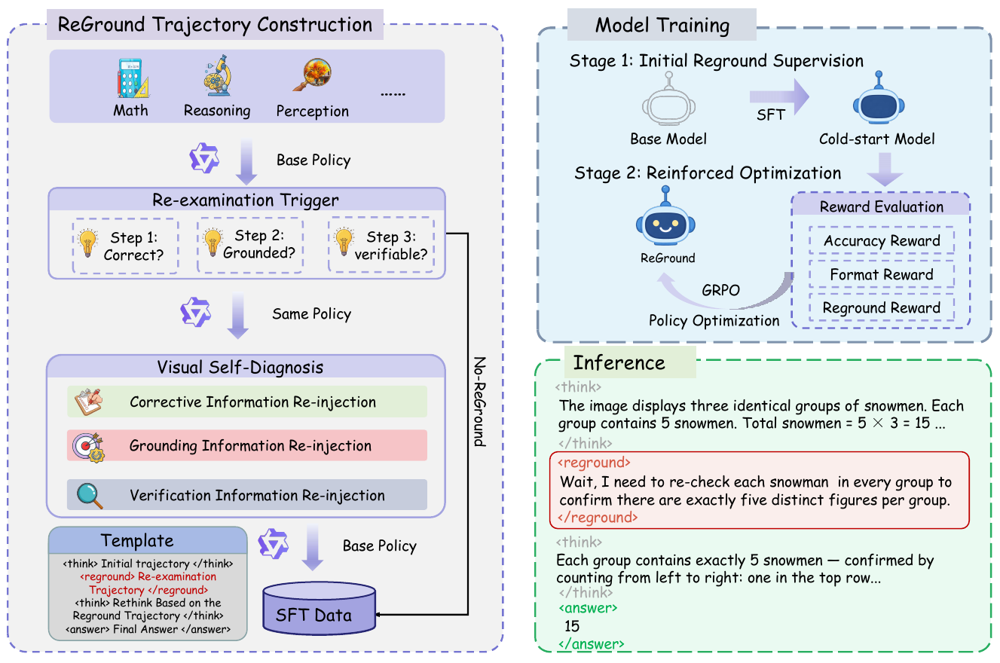
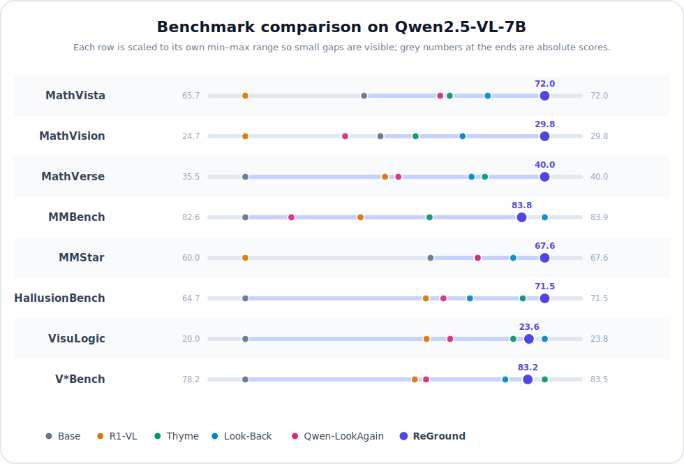

<p align="center">
  <a href="#-paper"></a>&nbsp;&nbsp;&nbsp;&nbsp;
  <a href="#-citation"></a>&nbsp;&nbsp;&nbsp;&nbsp;
  <a href="https://huggingface.co/SESPOIR/ReGround-Qwen2.5-VL-7B"></a>
</p>

## ✨ Overview

Vision-language models can gradually lose visual grounding during long reasoning chains. **ReGround** teaches a model to diagnose when its reasoning needs fresh visual evidence and to selectively re-examine the image.

At inference time, the model emits `<reground>` when re-examination is needed. The same image is then re-injected into the conversation, allowing the model to revise its reasoning before producing the final answer. ReGround requires no external visual tools or architecture changes.

This repository provides data construction, training, inference, and evaluation code for Qwen2.5-VL, built with [veRL](https://github.com/verl-project/verl), [vLLM](https://github.com/vllm-project/vllm), and [VLMEvalKit](https://github.com/open-compass/VLMEvalKit). The final model, trained with Stage-1 SFT followed by Stage-2 GRPO, is available on [Hugging Face](https://huggingface.co/SESPOIR/ReGround-Qwen2.5-VL-7B).

## 🔍 Method

<p align="center">
  
</p>

ReGround constructs self-diagnosis trajectories, initializes the policy with supervised fine-tuning, and refines its re-examination decisions with GRPO. At inference time, `<reground>` requests a fresh visual pass before the model produces its final answer.

## 📈 Results

<p align="center">
  
</p>

<p align="center"><sub>Direct comparison of Qwen2.5-VL-7B methods across eight benchmarks. Each row is scaled to its own min–max range so small gaps stay visible; grey numbers at the ends are absolute scores. Scores follow each benchmark's official evaluation protocol; higher is better.</sub></p>

## 🛠️ Setup

```bash
git clone https://github.com/sespoir/ReGround.git
cd ReGround
bash scripts/bootstrap.sh --with-server
conda activate reground
```

The setup script creates a private `.env` file. Use the Hugging Face model ID or a downloaded checkpoint path, and adjust the GPU settings if needed:

```bash
QWEN_MODEL_PATH=SESPOIR/ReGround-Qwen2.5-VL-7B
TENSOR_PARALLEL_SIZE=1
```

## 🧩 Data Construction

The dataset-agnostic generator in `data_generation/generate_sft.py` accepts JSON, JSONL, or Parquet records and uses OpenAI-compatible policy and teacher models to construct ReGround supervision. It routes samples according to answer correctness, visual grounding quality, and stochastic verification into Correction, Grounding, Verification, or No-ReGround trajectories.

The resulting single- and two-round conversations follow the `<think>`, `<reground>`, and `<answer>` format used for SFT. Run the pipeline with `data_generation/run_generation.sh`; field mappings, concurrency, checkpointing, and resume behavior can be configured through command-line options or environment variables.

## 🏋️ SFT Training

Stage 1 uses full-parameter supervised fine-tuning with LLaMA-Factory and DeepSpeed ZeRO-3. The public configuration matches the supplementary material: 2.5 epochs, an 8K context length, bf16 precision, a cosine learning-rate schedule with a peak rate of `8e-6`, and a per-device batch size of 1 with 6 gradient-accumulation steps.

The paths under `/tmp/reground` are placeholders. Replace the model directory, copy the generated SFT data and dataset registration file, then launch training:

```bash
mkdir -p /tmp/reground/data
cp /tmp/reground/generated/sft.jsonl /tmp/reground/data/sft.jsonl
cp training/dataset_info.json /tmp/reground/data/dataset_info.json
bash training/run_sft.sh
```

The reported run used 32 A100-80G GPUs. For multi-node reproduction, set the LLaMA-Factory launcher variables such as `NNODES`, `NODE_RANK`, `MASTER_ADDR`, and `MASTER_PORT` before running the same script.

## 🧭 GRPO Training

Stage 2 starts from the Stage-1 checkpoint and uses GRPO in [veRL](https://github.com/verl-project/verl). The custom agent loop performs a genuine two-round rollout: when the policy emits `<reground>`, it appends a masked environment turn, re-injects the original image, and lets the same policy finish the trajectory. The reward implements the paper's self-diagnosis, answer-accuracy, and format components, including the four-quadrant values reported in the supplementary material.

First convert generic visual-QA records into veRL Parquet files. Field names and answer indexing can be changed with command-line options:

```bash
python -m pip install -r grpo/requirements.txt
python grpo/prepare_dataset.py \
  --input /tmp/reground/raw/train.jsonl \
  --output-dir /tmp/reground/data/grpo \
  --image-root /tmp/reground/images
```

The public recipe is validated against veRL `v0.7.1` and mirrors the reported settings: 584 steps, group size 8, temperature `0.7`, learning rate `1e-6`, KL coefficient `0.01`, clip ratio `0.2`, and a 1,024-token policy-generation budget. Replace the `/tmp/reground` placeholders, prepare a 32-GPU Ray cluster if reproducing the paper setting, and launch:

```bash
git clone --branch v0.7.1 https://github.com/verl-project/verl.git /tmp/verl-v0.7.1
VERL_ROOT=/tmp/verl-v0.7.1 bash grpo/run_grpo.sh
```

`data.max_response_length=4096` reserves room for the masked second image turn; `max_generated_tokens=1024` still enforces the paper's policy-token limit across both rounds. To validate the complete Hydra configuration without starting Ray or using a GPU, set `REGROUND_GRPO_CONFIG_ONLY=true`.

## 🚀 Inference

Start the OpenAI-compatible vLLM server:

```bash
bash scripts/serve_vllm.sh
```

Run a two-round smoke test in another terminal:

```bash
conda activate reground
python scripts/smoke_test_reground.py \
  --image /path/to/image.jpg \
  --question "What is shown in this image?"
```

The adapter preserves the first response, detects `<reground>`, re-injects the original image, and returns the final `<answer>` content.

## 📊 Evaluation

Set the dataset and endpoint in `.env`, then run:

```bash
bash scripts/evaluate.sh
```

The default configuration evaluates `HallusionBench` with exact matching. For Slurm clusters, equivalent jobs are available in `jobs/serve_vllm.sbatch` and `jobs/evaluate.sbatch`.

## 🧪 Tests

```bash
ruff check src scripts tests data_generation grpo
python -m unittest discover -s tests -p 'test_*.py'
bash -n scripts/*.sh jobs/*.sbatch data_generation/*.sh training/*.sh grpo/*.sh
bash scripts/secret_scan.sh
```

## 📄 Paper

Coming Soon.

## 📝 Citation

Formal BibTeX: Coming Soon.

## 🙏 Acknowledgements

This project is built on [Qwen2.5-VL](https://github.com/QwenLM/Qwen2.5-VL), [vLLM](https://github.com/vllm-project/vllm), and [VLMEvalKit](https://github.com/open-compass/VLMEvalKit). We thank their authors for making their work publicly available.

## 📄 License

Released under the [Apache License 2.0](LICENSE).
