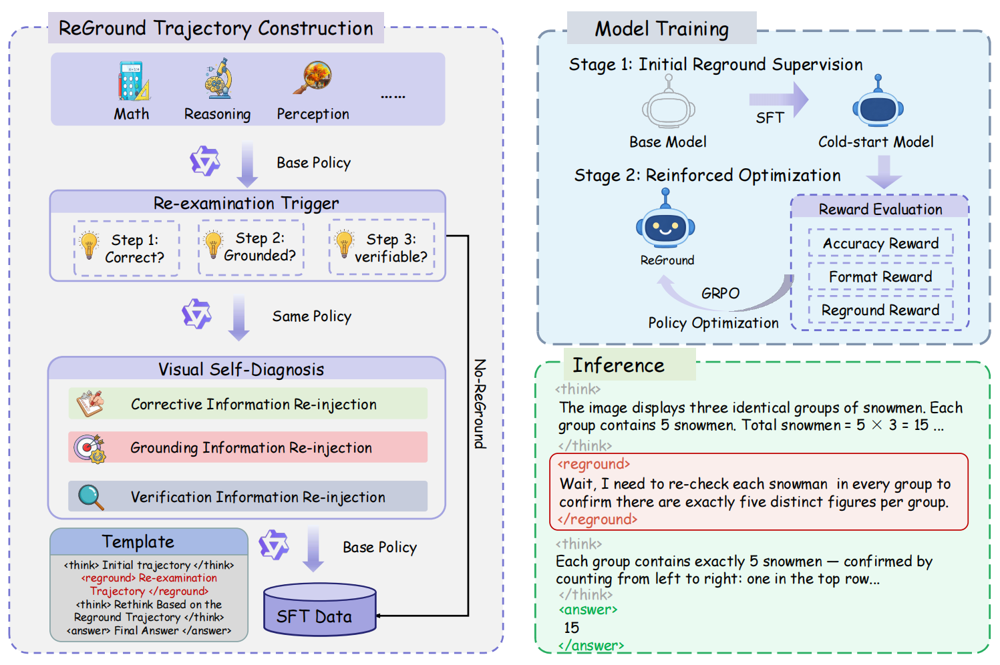

<div align="center">

# ReGround: Restoring Visual Grounding in Multi-Step Reasoning through Self-Diagnosis and Visual Re-Examination

### ACM Multimedia 2026

</div>

<p align="center">
  
</p>

## ✨ Overview

Vision-language models can gradually lose visual grounding during long reasoning chains. **ReGround** teaches a model to diagnose when its reasoning needs fresh visual evidence and to selectively re-examine the image.

At inference time, the model emits `<reground>` when re-examination is needed. The same image is then re-injected into the conversation, allowing the model to revise its reasoning before producing the final answer. ReGround requires no external visual tools or architecture changes.

This repository provides the inference and evaluation implementation for Qwen2.5-VL, built with [vLLM](https://github.com/vllm-project/vllm) and [VLMEvalKit](https://github.com/open-compass/VLMEvalKit).

## 🛠️ Setup

```bash
git clone https://github.com/sespoir/ReGround.git
cd ReGround
bash scripts/bootstrap.sh --with-server
conda activate reground
```

The setup script creates a private `.env` file. Add the local checkpoint path and adjust the GPU settings if needed:

```bash
QWEN_MODEL_PATH=/absolute/path/to/checkpoint
TENSOR_PARALLEL_SIZE=1
```

## 🚀 Inference

Start the OpenAI-compatible vLLM server:

```bash
bash scripts/serve_vllm.sh
```

Run a two-round smoke test in another terminal:

```bash
conda activate reground
python scripts/smoke_test_reground.py \
  --image /path/to/image.jpg \
  --question "What is shown in this image?"
```

The adapter preserves the first response, detects `<reground>`, re-injects the original image, and returns the final `<answer>` content.

## 📊 Evaluation

Set the dataset and endpoint in `.env`, then run:

```bash
bash scripts/evaluate.sh
```

The default configuration evaluates `HallusionBench` with exact matching. For Slurm clusters, equivalent jobs are available in `jobs/serve_vllm.sbatch` and `jobs/evaluate.sbatch`.

## 🧪 Tests

```bash
ruff check src scripts tests
python tests/test_reground_payload.py
bash scripts/secret_scan.sh
```

## 🙏 Acknowledgements

This project is built on [Qwen2.5-VL](https://github.com/QwenLM/Qwen2.5-VL), [vLLM](https://github.com/vllm-project/vllm), and [VLMEvalKit](https://github.com/open-compass/VLMEvalKit). We thank their authors for making their work publicly available.

## 📄 License

Released under the [Apache License 2.0](LICENSE).
